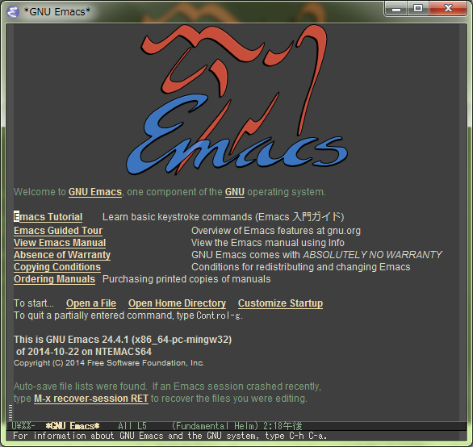
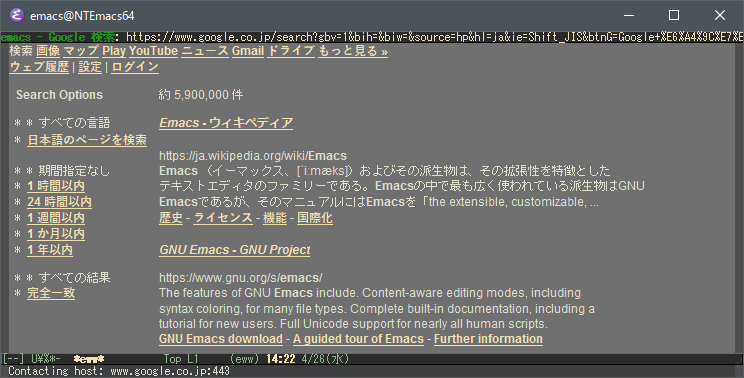

NTEmacs64
=========

Windows 版 Emacs (通称 NTEmacs) の 64bit 版 version 24.4



※ メニューバーとツールバーを非表示にして zenburn のテーマを適用した状態の起動画面です。

バイナリ説明
------------

**emacs-24.4.zip** IMEパッチ未適用版 (ソースに一切手を加えずにビルドしたバージョン)  
**emacs-24.4-IME-patched.zip** IMEパッチ適用版

### 起動方法
**emacs-24.4.zip** を展開すると **emacs-24.4/** フォルダが出来るので **emacs-24.4/bin/runemacs.exe** を実行します。

### 特徴
* ソースには一切手を加えずにビルドしています
* MSYS2 (MSYS の改良版) を使用してビルドしているので Cygwin に依存していません
 * Emacs 上でのパスの扱いなどが自然になります
* 64bit 版です
 * 公式ビルドは今のところ Windows 用の 64bit 版バイナリを提供していません
* gcc に **-Ofast -march=corei7 -mtune=corei7** を付けて最適化ビルドされています
* 画像対応させる為の最低限の DLL を同梱しています (**GIF, PNG, JPEG, TIFF, XPM**)
 * 本来は SVG の表示にも対応可能ですが、依存 DLL(主に GTK+ 関連) が多すぎるので含めていません
* **libxml2, GnuTLS, D-Bus** の DLL も同梱しています
 * elisp で実装されたテキストブラウザ M-x eww も動作確認済みです
   
 * D-Bus は Linux 環境では便利な機能ですが、Windows 上ではほぼ使い道がありませんが、ビルドが通ったため同梱しています
 * 追加した DLL は全て emacs-24.4/bin/ 以下にあります (bin/*.dll 以外追加したファイルはありません)
* サウンド再生もサポート
* IMEパッチを適用したビルドを別途追加しました
 * <https://gist.github.com/rzl24ozi> で最小構成に整理されたIMEパッチがアップされたので、それを適用しました  
パッチを整理していただきありがとうございます！  
IMEを有効にするには以下の設定が必要です  
  ```emacs-lisp
  (set-language-environment "Japanese")
  (w32-ime-initialize)
  (setq default-input-method "W32-IME")
  (setq-default w32-ime-mode-line-state-indicator "[--]")
  (setq w32-ime-mode-line-state-indicator-list '("[--]" "[あ]" "[--]"))
  ```

### 注意事項
* NTEmacs24.4 からは NTEmacs24.3 とはフォルダ構成が変わっています
 * 古い DDSKK はフォルダ構成を認識できない問題や 24.4 で使用する場合に不具合があります  
DDSKK は cvs 版のバージョン 15.1.91 以降を使用してください
* IMEパッチは適用していないので MS-IME などを使用した日本語入力に問題があります
 * これは公式ビルドであっても同じです
 * Google 日本語入力であれば入力が可能な事を確認しました  
(ただしIMEパッチ適用時のような、変換中の文字が Emacs 内で表示される訳ではありません)
 * ちなみに、標準状態で日本語が全く入力出来ない訳ではありません  
C-\ で日本語入力が可能です (変換効率は悪いですが…コメント入力程度であれば問題ありません)  
Help は C-\ で日本語入力モードにした後に C-h C-\ return で見る事が出来ます  
常用するには以下の設定だけはしておいた方がいいかもしれません  
  ```emacs-lisp
    (setq quail-japanese-use-double-n t) ;; 「ん」を n 2回で入力 (デフォは1回)
  ```

ビルド方法
----------

<http://ftp.gnu.org/gnu/emacs/emacs-24.4.tar.xz>
を、ソースに一切手を加えずにビルドします。

### MSYS2 のインストール
<http://sourceforge.net/projects/msys2/>
から **msys2-x86_64-20141003.exe** (2014/10/22 時点の最新) を取得しインストールします。

### 64ビット環境用のシェルの起動
インストールディレクトリ (c:/msys64) 直下の **mingw64_shell.bat** を起動します。

### ビルド関連パッケージのインストール
    $ pacman -S base-devel
    $ pacman -S mingw-w64-x86_64

    どちらもかなり時間が掛かります

### ビルドとインストール
    $ tar xvJf emacs-24.4.tar.xz
    $ cd emacs-24.4/

    ソースを展開してディレクトリに移動します

    $ patch -p0 < emacs-24.4-w32-ime.diff
    $ autoconf

    IMEパッチを適用する場合はパッチあてて configure スクリプトを更新します
    適用しない場合は上記2行は実行しないでください

    $ export MSYSTEM=MINGW32

    デフォで MINGW64 になって configure がコケるので騙す為です (32bit ビルドになる訳ではありません)
    これがミソ

    $ CFLAGS='-Ofast -march=corei7 -mtune=corei7' ./configure

    CFLAGS で適当な最適化オプションを指定します
    ※ --prefix=c:/emacs24.4 と指定した時に site-lisp/ が認識されない不具合が発生したので --prefix は付けません

    $ make bootstrap && make install

    これでおしまい (make install-strip するとなぜか exe が壊れます…原因調査中)
    
    --prefix を付けないと c:/msys64/usr/local/ 以下にインストールされています

### 今後の予定
* ~~IME パッチの適用~~ (別途追加しました)

## 謝辞
そもそもの発端は、公式ビルド含め巷のビルドは自分で納得できるものがなかったので  
色々調べているうちに MSYS2 を使えば出来そうな事が分かり、ビルドしてみた事が始まりでした。  

最終的に「64bit版・最適化ビルド・ソース未変更」のビルドを作成する事は出来たので、ひとまず満足しています。  
さらに [rzl24ozi 氏](https://gist.github.com/rzl24ozi) によりIMEパッチを整理して頂いた為IMEパッチ版も追加してみました。  

最後に、このような素晴らしいソフトウェアを生み出し改良し続けている関係者の方々に最大限の感謝を表し──  

Have Fun!


ビルド関連追記
--------------

### configure の出力抜粋
    Configured for `x86_64-pc-mingw32'.
    
      Where should the build process find the source code?    .
      What compiler should emacs be built with?               gcc  -std=gnu99 -Ofast -march=corei7 -mtune=corei7
      Should Emacs use the GNU version of malloc?             yes
      Should Emacs use a relocating allocator for buffers?    yes
      Should Emacs use mmap(2) for buffer allocation?         no
      What window system should Emacs use?                    w32
      What toolkit should Emacs use?                          none
      Where do we find X Windows header files?                NONE
      Where do we find X Windows libraries?                   NONE
      Does Emacs use -lXaw3d?                                 no
      Does Emacs use -lXpm?                                   yes
      Does Emacs use -ljpeg?                                  yes
      Does Emacs use -ltiff?                                  yes
      Does Emacs use a gif library?                           yes
      Does Emacs use a png library?                           yes
      Does Emacs use -lrsvg-2?                                yes
      Does Emacs use imagemagick?                             no
      Does Emacs support sound?                               yes
      Does Emacs use -lgpm?                                   no
      Does Emacs use -ldbus?                                  yes
      Does Emacs use -lgconf?                                 no
      Does Emacs use GSettings?                               no
      Does Emacs use a file notification library?             yes (w32)
      Does Emacs use access control lists?                    yes
      Does Emacs use -lselinux?                               no
      Does Emacs use -lgnutls?                                yes
      Does Emacs use -lxml2?                                  yes
      Does Emacs use -lfreetype?                              no
      Does Emacs use -lm17n-flt?                              no
      Does Emacs use -lotf?                                   no
      Does Emacs use -lxft?                                   no
      Does Emacs directly use zlib?                           yes
      Does Emacs use toolkit scroll bars?                     yes

### configure の出力抜粋 (IMEパッチ版)
    Configured for `x86_64-pc-mingw32'.
    
      Where should the build process find the source code?    .
      What compiler should emacs be built with?               gcc  -std=gnu99 -Ofast -march=corei7 -mtune=corei7
      Should Emacs use the GNU version of malloc?             yes
      Should Emacs use a relocating allocator for buffers?    yes
      Should Emacs use mmap(2) for buffer allocation?         no
      What window system should Emacs use?                    w32
      What toolkit should Emacs use?                          none
      Where do we find X Windows header files?                NONE
      Where do we find X Windows libraries?                   NONE
      Does Emacs use -lXaw3d?                                 no
      Does Emacs use -lXpm?                                   yes
      Does Emacs use -ljpeg?                                  yes
      Does Emacs use -ltiff?                                  yes
      Does Emacs use a gif library?                           yes
      Does Emacs use a png library?                           yes
      Does Emacs use -lrsvg-2?                                yes
      Does Emacs use imagemagick?                             no
      Does Emacs support sound?                               yes
      Does Emacs use -lgpm?                                   no
      Does Emacs use -ldbus?                                  yes
      Does Emacs use -lgconf?                                 no
      Does Emacs use GSettings?                               no
      Does Emacs use a file notification library?             yes (w32)
      Does Emacs use access control lists?                    yes
      Does Emacs use -lselinux?                               no
      Does Emacs use -lgnutls?                                yes
      Does Emacs use -lxml2?                                  yes
      Does Emacs use -lfreetype?                              no
      Does Emacs use -lm17n-flt?                              no
      Does Emacs use -lotf?                                   no
      Does Emacs use -lxft?                                   no
      Does Emacs directly use zlib?                           yes
      Does Emacs use toolkit scroll bars?                     yes
      Does Emacs support W32-IME?                             yes
      Does Emacs support RECONVERSION?                        yes
      Does Emacs support DOCUMENTFEED?                        yes

### emacs-24.4/bin/*.dll の依存関係など
* 以下の DLL 以外追加したファイルはありません
* DLL は全て MSYS2 からコピーしたものです
* 依存関係は Windows に標準インストールされているものは含めていません
```
 emacs.exe
 ├ libwinpthread-1.dll
 └ libdbus-1-3.dll
 
 XPM
 libXpm-noX4.dll
 
 JPEG
 libjpeg-8.dll
 
 PNG
 libpng16-16.dll
 └ zlib1.dll
 
 GIF
 libgif-7.dll
 
 TIFF
 libtiff-5.dll
 ├ libjbig-0.dll
 ├ libjpeg-8.dll
 ├ liblzma-5.dll
 └ zlib1.dll
 
 LIBXML2
 libxml2-2.dll
 ├ libiconv-2.dll
 ├ liblzma-5.dll
 └ zlib1.dll
 
 GnuTLS
 libgnutls-28.dll
 ├ libwinpthread-1.dll
 ├ libgmp-10.dll
 ├ libhogweed-2-5.dll
 │ ├ libgmp-10.dll
 │ └ libnettle-4-7.dll
 ├ libintl-8.dll
 │ └ libiconv-2.dll
 ├ libnettle-4-7.dll
 ├ libp11-kit-0.dll
 │ ├ libffi-6.dll
 │ └ libintl-8.dll
 ├ libtasn1-6.dll
 └ zlib1.dll
```

### Help から C のソースに設定無しで飛ぶ方法
* emacs-24.4.zip を c:/emacs-24.4 に展開して emacs-24.4.tar.xz を同じフォルダに展開すると
Help から C のソースに自動で飛ぶようになります
(emacs-24.4.zip と emacs-24.4.tar.xz は被るフォルダやファイルは無いので上書きの心配はありません)
 * c:/emacs-24.4 でないと毎回聞かれる事になるので、以下の設定が必要です
  ```emacs-lisp
    (setq source-directory "/path/to/emacs/source/dir")
  ```
